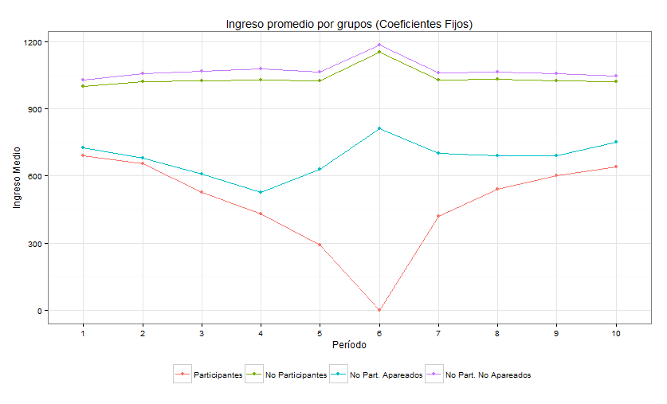
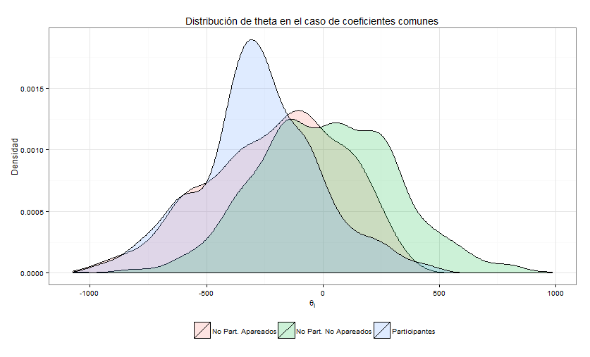
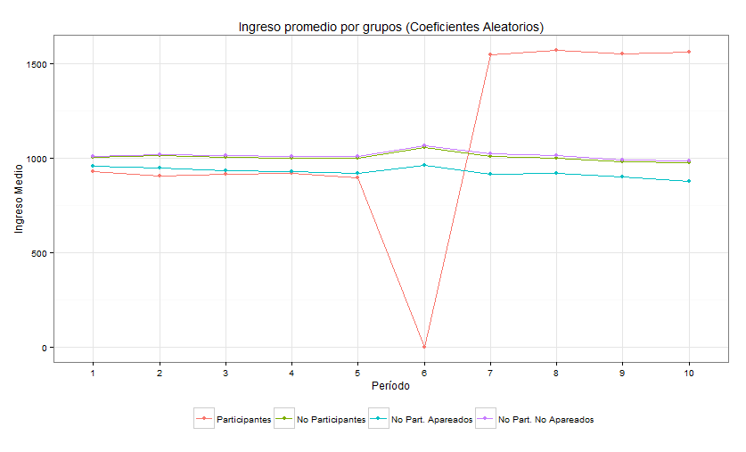
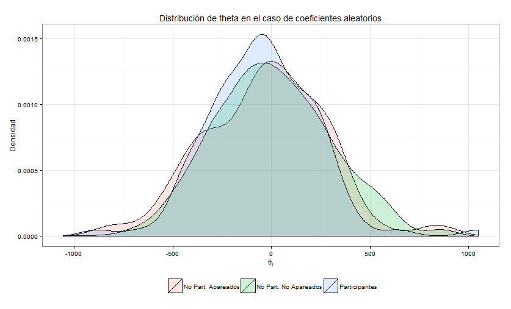

\newpage

# Detalles de la simulación

## Modelo utilizado

El presente trabajo práctico busca replicar los resultados de Heckman, Lalonde y Smith (1999)[@HLS1999], quienes afirman que los modelos de evaluación de impacto de políticas públicas poseen dos elementos:

1. El modelo de la variable de resultado
2. El modelo para la participación en el programa

La estructura que se utiliza en este trabajo (y que utilizan los autores) puede describirse por medio de las siguientes ecuaciones:

$$ Y_{it}=\beta+\alpha_{i}D_{i}+\theta_{i}+U_{it} $$ si $t>k$.
$$ Y_{it}=\beta+\theta_{i}+U_{it} $$ si $t<k$.
$$ U_{it}=\rho U_{it-1}+\epsilon_{it}$$

En donde $Y_{it}$ es el ingreso de los individuos, $\beta$ es una forma de ingreso permanente, $\alpha_{i}$ es el efecto del programa para quienes acceden a él, $\theta_{i}$ es un efecto fijo individual no observable. Por su parte el componente no observable posee una parte que evoluciona como un proceso estcástico autoregresivo de orden 1 cuyo coeficiente de autocorrelación está dado por el parámetro $\rho$, a su vez éste componente no observable posee un shock aleatorio contemporáneo $\epsilon_{it}$.

El entrenamiento tiene lugar en el año $k$ y los individuos que deciden participar de éste los que la variable dummy $D_{i}$ es igual a uno. La decisión de participar depende del valor actual esperado de los beneficios futuros ($\alpha_{i}/r$, dónde $r$ es la tasa de descuento), del ingreso que se renuncia en el año que accede al programa de entrenamiento $Y_{ik}$ y de un costo idiosincrático específico a cada individuo $c_{i}$ que se interpreta como la matrícula que debe pagar (en el caso que sea positivo) o el subsidio que recibe para participar (en el caso que sea negativo) y que se describe por medio de la fórmula: $c_{i}=\Phi Z_{i}+V_{i}$, dónde $Z_{i}$ y $V_{i}$ son variables aleatorias independientes entre sí y de las demás.

$$ D_{i}=\begin{cases} 1 & \alpha_{i}/r-Y_{ik}-c_{i}>0\text{ y }t>k\\ 0 & \text{ caso contrario}\end{cases} $$

## Proceso generador de datos

Para el ejercicio de simulación se utilizan las siguientes variables y distribuciones:

* Existen 1000 individuos para los que se simulan 10 años de datos de ingresos y a su vez, se replican 100 muestras.
* Los 10 años se distribuyen de la sigueinte forma: hay 5 años pre programa ($k-5$ a $k-1$), un año de implementación ($k=6$) y cuatro años post programa ($k+1$ a $k+4$).
* El ingreso permanente es igual para todos los individuos ($\beta=1000$).
* El efecto tratamiento ($\alpha_{i}$) se distribuye como normal con media 100 y desv. estándar igual a 300: $\alpha_{i}\sim N(100,300)$.
* El efecto fijo también se distribuye de la misma forma con media 0 y desv. estándar igual a 300: $\alpha_{i}\sim N(100,300)$.
* El componente idiosincrático de error se distribuye también como normal con media igual a 0 y desv. estándar igual a 280: $\epsilon_{it}\sim N(100,280)$.
* Se supone que $U_{ik-5}=\epsilon_{ik-5}$ y que $\rho=0,78$.
* Por último los componentes de la función de costos se distribuyen como normales con $\Phi=1$, $V_{i}\sim N(100,200)$ y $Z_{i}\sim N(\mu_{Z},200)$, dónde $\mu_{Z}$ se escoge de manera tal que para todas las muestras el 10\% de la población participe del programa y la tasa de interés ($r$) es igual a 0,10.

## Carga de los parámetros

En primer lugar, el programa requiere que se fijen valores para todos los parámetros, según lo indicado en el punto anterior:

```{r}
n<-1000
beta<-rep(1000,n)
r<-0.1
rho<- 0.78
phi<-1
mean_alpha<-100
sd_alpha<-300 #(=0 para el modelo de coeficientes comunes, =300 para coef. aleatorios)
mean_theta<-0
sd_theta<-300
mean_epsilon<-0
sd_epsilon<-280
mean_v<-0
sd_v<-200
sd_z<-300
```

El comando ``rep`` replica el valor de $\beta$ (1000) $n$ veces, en esta caso también igual a 1000 con el objeto de agregarlo posteriormente a los vectores de ingresos.

Luego, se generan las variables aletorias tambén detalladas previamente:

```{r}
#Generar variables aleatorias
alpha_i<-rnorm(n, mean_alpha, sd_alpha)
theta_i<-rnorm(n, mean_theta, sd_theta)
V_i<-rnorm(n, mean_v, sd_v)
Epsilon_it<-replicate(10, rnorm(n, mean_epsilon, sd_epsilon)) 
```
Las variables aleatorias $\alpha_{i}$, $\theta_{i}$ y $V_{i}$ se crean con una funcion ``rnorm`` que genera $n$ números aletorios normalmente distribuidos cuya media es el valor que corresponde al segundo argumaneto y su desviación estándar es igual al tercero. Los valores de $\epsilon_{it}$ deben ser distintos apra cada uno de los 10 años, por lo que se generó una matriz de $1000\times 10$ (1000 individuos en 10 años) de numeros aleatorios normales con media y desviación estándar detalladas, para ello se utilizó el comando _replicate_ que, justamente, replica el vector de 1000 número aleatorios 10 veces, generando cada vez una realización distinta.

Para los valores del término aleatorio $U_{it}$ y para los ingresos $Y_{it}$ se optó por la siguiente estrategia: crear dos matrices de $1000\times 10$ dónde cada columna es uno de los 10 años en los que se simula la intervención y cada fila es uno de los 1000 individuos que forman parte del estudio.

```{r}
#Generar data frame para guardar los datos
dat<-data.frame(matrix(0, ncol=10, nrow=n))

#Nombres de las 10 columnas de la matriz de ingresos
y<-rep(0,10)
for(i in 1:10){
  y[i]<-paste("y_",i, sep="")
}
colnames(dat)<-y
```
En primer lugar se genera una matriz "vacía" de dimensiones $1000\times 10$ (en realidad con todos sus elementos iguales a cero) y luego se colocan los nombres de las columnas con un bucle, de manera tla que sean iguales a $Y_i$ con $i=1\dots,10$.

De idéntica manera se crea la matriz ``Ui_t``, la cual posee la particularidad que sus columnas dependen de los valores de la matriz ``Epsilon_it``, la primer columna de ambas matrices es igual, pero de la columna 2 en adelante se crean según la fórmula del proceso AR(1).

```{r}
U_it<-matrix(0, nrow=n, ncol=10)
U_it[,1]=Epsilon_it[,1]

for(k in 2:10){
  U_it[,k]=rho*U_it[,k-1]+Epsilon_it[,k]
}
```
Luego se procede a rellenar los valores de la matriz de ingresos (``dat``), para ello se requieren valores para $D_{i}$ pero, dado que para los períodos 1 a 6 nadie participa porque todavía no se implementó el programa, son iguales a cero para todos los individuos.

```{r}
#Período incial
#Nadie participa antes de la implementación del programa
D_i<-rep(0, n)
dat[,1]<-beta+alpha_i*D_i+theta_i+U_it[,1]

#Períodos 2 a 5: se generan los ingresos según la ley de movimiento de U_it
for(k in 2:5){
  dat[,k]<-beta+alpha_i*D_i+theta_i+U_it[,k]
}
```

En el período 6 se implementa el programa y, como primera medida, debe individualizarse a quienes participan de los que no por medio de la variable $D_{i}$, éste valor dependerá de la media de la variable aleatoria $Z_{i}$, la cual debe fijarse de manera tal que para cada muestra participe el 10\% de los individuos. Ésto se logró por medio de un bucle que itera hasta que se cumple la condición especificada, ahora bien, la velocidad de convergencia depende del valor inicial, elcual, tras varias pruebas se fijó en 700 para el modelo de coeficientes coumes ($\alpha_{i}=\alpha\, \forall i$) y en 4000 para el modelo de coeficientes aleatorios.

```{r, message=FALSE}
#mu<-700 Coeficientes comunes
mu<-4000 #Coeficientes aleatorios
ntreated<-0
y<-beta+alpha_i*D_i+theta_i+U_it[,6]
while(ntreated!=100){
  Z_i<-rnorm(n, mu, sd_z)
  c_i<-Z_i*phi+V_i
  D_i<-as.numeric(I((alpha_i/r-y-c_i)>0))
  ntreated<-as.numeric(table(D_i)[2])
  #si participantes < 1000 reduce la media de u, caso contrario la aumenta
  if(ntreated<100){
    mu=mu-1
  }else{
    mu=mu+1
  }
}
  print(paste("Media de u: ", mu))
  print(paste("Número de participantes: ", ntreated))  
```

El algoritmo converge rápidamente al valor de 100 individuos, a partir de los cuales se genera el vector $D_{i}$ que indica cuáles de ellos participan del programa y cuales no.

Luego se rellenan los valores del período 6 haciendo que $Y_{ik}=0$ si $D_{i}=1$ (quienes participan no obtienen ingresos en el período), mientras que los que no participan continuán generando sus ingreos según la misma ley de movimiento. Por último, para los períodos 7 a 10 se vuelve al esquema anterior, pero partiendo de los nuevos valores de $D_{i}$ iguales a 1 para 100 perosnas y cero apra los 900 remanentes.

```{r}
#Reemplazo valores para el período 6 (0 para los que participan)
dat[,6]<-(1-D_i)*(beta+alpha_i+theta_i+U_it[,6])


#Períodos 7 a 10: se generan los ingresos según la ley de movimiento
for(k in 7:10){
  dat[,k]<-beta+alpha_i*D_i+theta_i+U_it[,k]
}
```

Una vez creada la matriz de valores puede observarse su composición por medio de los valores de los primeros 6 individuos a través del comando ``head``:

```{r}
head(dat)
```

Y luego, se agregan las columnas de valores de $\alpha_{i}$ y $D_{i}$ a la matriz de datos, puesto que se los requerirá posteriormente.

```{r}
dat<-cbind(dat, alpha_i, D_i)
```

# Matching

Ahora se utiliza un estimador de "matching" con el objeto de aparear observaciones entre los 100 individuos del grupo de tratamiento y un subconjunto de individuos del grupo de contol. En este caso el apareamiento se realiza por el criterio del "vecino más cercano" (nearest neighbour) con reemplazo.

Para realizar el mencionado análisis se utilizó la librería "MatchIt"[@Match], la cual posee un comando para aparear datos (``matchit``), utilizando diversos métodos de matching (exacto, genético, vecino más cercano, óptimo, etc.) y permitiendo también escoger la función de distancia a utilizar, en este caso se optó por la función logística, además, se incluye la opción ``replace=TRUE`` para que el apareamiento sea con reemplazo.

```{r}
library(MatchIt)
match<-matchit(D_i~y_4, method="nearest", distance="logit", data=dat, replace=TRUE)
summary(match)
```

Una vez realizado el matching, se deben calcular las medias de los $\alpha_{i}$ para el total de la muestra y para los individuos del grupo de tratamiento ($D_{i}=1$).

```{r}
#Conjunto de datos apareados (weights=1)
m.data<-match.data(match)

#Medias de los alfas para los grupos apareados y no apareados 
mean_alpha_i<-mean(dat$alpha_i)       #E(alpha_i)
w1<-subset(m.data, weights==1)
mean_alpha_i_Tr<-mean(w1$alpha_i)     #E(alpha_i/D_i=1)
rm(w1)

#Resultados
mean_alpha_i
mean_alpha_i_Tr
````

El valor de $E(\alpha_{i}/D_{i}=1)$ es muy superior al de $E(\alpha_{i})$, reflejando el efecto del tratamiento medio sobre los tratados (ATT), mientras que la segunda es el efecto medio del tratamiento (ATE). Estos resultados son importantes para, luego, calcular el sesgo de los estimadores tras realizar la simulación de montecarlo.

# Gráficos

En esta sección se replicarán los gráficos de la sección 8.3.4 de Heckman et Al. Con el obejto de mostrar la existencia (o no) del llamado "Ashenfelter's dip", fenómeno que ocurre cuando no se cumple el supuesto de identificación del estimador de diferencias en diferencias.

El mencionado supuesto de identificación del estimador DiD afirma que, en ausencia del programa de entrenamineto, el cambio en los ingresos entre dos períodos de tiempo $t$ y $t'$ debería haber sido el mismo para los que participan como para los que no, esto es que se cumpla:

$$ E(Y_{0t}-Y_{0t'}/D=1)=E(Y_{0t}-Y_{0t'}/D=0) $$

Ashenfelter (1978)[@Ash1978] observó un hecho estilizado, el cual consiste en que, previo a inscribirse en un programa de entrenamiento los participantes experimentan una caída en sus ingresos, tanto en términos absolutos como relativo a los del grupo de control. Éste fenómeno sugiere que al menos una parte del incremento de los ingresos posterior a la implementación del programa se debe a una reversión del ingreso permanente que fuera interrumpido temporalmente por un shock adverso.

El supuesto de identificación del estimador de diferencias en diferencias puede no cumplirse en la medida que el momento base $t'$ coincida con el moemnto del "dip" transitorio y, si los no participantes no experimentan la mencionada caída, el sendero temporal de los ingresos será diferente entre participantes y no participantes entre los momentos $t$ y $t'$, en este caso el estimador DiD sobreestimará el efecto del entrenamiento en los participantes.

Para evaluar la existencia del "dip" es necesario contar priemro con los datos del ingreso promedio por cada período de cuatro grupos, donde $w$ es la ponderación de la observación apareada.

* Participantes del programa (individuos con $D_{i}=1$)
* No participantes del programa (individuos con $D_{i}=0$)
* No participantes apareados (individuos con $D_{i}=0$ y $w\neq 0$)
* No participantes apareados (individuos con $D_{i}=0$ y $w=0$)


```{r, echo=FALSE, message=FALSE}
library(dplyr)
dat<-cbind(dat, match$weights, D_i)
names(dat)[names(dat)=="match$weights"] <- "weight"

#Cuadro de las medias por cada grupo
medias<-data.frame(matrix(0, ncol=4, nrow=10))
names(medias)<-c("Participantes", "No Participantes", "No Part. Apareados", "No Part. No Apareados")

partc<-as.numeric(I(dat$weight!=0))
dat<-cbind(dat, partc)

for(j in 1:10){
  medias[j,1]<-aggregate(dat[,j]~partc+D_i, dat, mean )[3,3]
  medias[j,2]<-aggregate(dat[,j]~D_i, dat, mean )[1,2]
  medias[j,3]<-aggregate(dat[,j]~partc+D_i, dat, mean )[2,3]
  medias[j,4]<-aggregate(dat[,j]~partc+D_i, dat, mean )[1,3]
}
Periodo<-seq(1,10,1)
medias<-cbind(Periodo, medias)
```

En el primer gráfico se muestra el "Ashenfelter's dip" para el caso de coeficientes fijos, dónde claramente hay una caída en el ingreso de los individuos que participan del programa en el año previo a iniciarlo. Cabe señalara que la participación en el programa de éstos, si bien aumenta sus ingresos, no llega a igualar a los de los no participantes, debido a que el obtener un beneficio positivo por participar implica que los individuos poseen una productividad baja y por lo tanto inferior a la media de la población no participante.



El gráfico de las distribuciones de los $\theta_{i}$ muestra que éstas difieren bastante entre participantes y no participantes en el caso de los coeficientes comunes.



Para el caso de coeficientes aleatorios se observa que los resultados son muy diferentes:



La figura del ingreso promedio para cada período difiere notablemente de la obtenida por Heckman et Al. (Fig. 15, pág. 2023) porque se observa un salto de gran magnitud en los ingresos del grupo tratado a partir del período 7, debido a la magnitud de $alpha_{i}$.



Como contracara de lo anterior, las distribuciones de los distintos subgrupos en el caso de los coeficientes aleatorios son muy similares, reflejando con mucha exactitud los resultados de Heckman.

Resumiendo, la diferencia entre el caso de coeficientes fijos y el de coeficientes aleatorios reside en el mecanismo de seleccíon, porque en el segundo sólo dependerá de $\theta_{i}$ y de $U_{it}$ ya que la ganancia de participar es igual para todos ya que $\alpha$ es idéntico para todos los individuos, y es ésta autoselección la que se refleja en el "dip" mas pronunciado para éste caso.

# Simulación de montecarlo

La simulación de montecarlo es un método de simulación que se basa en remuestreos repetidos de la misma población, en este caso se basa en generar 100 muestras de 1000 individuos a los cuales se les estiman un conjunto de estimadores que se detallarán  a continuación.

## Estimador "Cross-section"

Este estimador se basa en comparar las medias de ingresos entre participantes y no participantes en el momento $t$, en este caso se escogen cuatro momentos: $k+1$, $k+2$, $k+3$ y $k+4$.

Siguiendo a [@HLS1999, pág 1986], éste estimador no comapra a la misma persona ya que ésta no puede pertenecer simultáneamente a los grupos de control y de tratamiento, sino que lo hace invocando un supuesto de identificación adicional:

$$ E(Y_{0t}/D=1)=E(Y_{0t}/D=0) $$

Esto es, que las personas que no participan del programa poseen el mismo resultado sin tratamiento que los que participan. Si éste supuesto es válido, el estimador de corte transversal es:

$$ \left(\overline{Y}_{1t}\right)_{1}-\left(\overline{Y}_{0t}\right)_{0} $$

Y es válido bajo el supuesto de identificación porque:

$$ E\left[\left(\overline{Y}_{1t}\right)_{1}-\left(\overline{Y}_{0t}\right)_{0}\right]=E(\Delta_{t}/D=1) $$

La implementación consiste en calcular una regresión simple por Mínimos Cuadrados Ordinarios de $Y_{it}$ en $D_{i}$ para cada período. Comom primer lugar se obtiene la submuestra de individuos apareados a partir de la variable ``partc``, una dummy igual a 1 si el individuo $i$ del grupo de control fue matcheado con otro del grupo de tratamiento y 0 en caso contrario. Luego se repiten las estimaciones, primero para toda la población y luego sólo para el grupo apareado (igual a los 100 individuos del grupo de tratamiento más sus contrapartes apareadas en el grupo de control).

El comando ``lm`` realiza una regresión lineal entre ``y_t`` y ``D_i`` y garda los resultdos en la variable ``regci`` $(i=1, 2, 3, 4)$, con el comando ``summary`` se obtiene el valor del coeficiente de la variable ``D_i``. Por último se utiliza el comando ``vcovHC`` para estimar los errores estandar robustos a heterocedasticidad y autocorrelación [@Zeileis2006], la opción ``type="HC1"`` se agrega para que el resultado sea similar al comando ``robust`` de Stata e indica la forma que deberá tener la matriz de White, En este caso no es otra cosa que una corrección por grados de libertad de dicha matriz, si $e_{i}$ son los errores de la regresión y $\mathbf{X}$ es la matriz de regresores, éste estimador de la matriz de covarianzas será:

$$ HC1=\frac{N}{N-k}(\mathbf{X}'\mathbf{X})^{-1}\mathbf{X}diag[e_{i}^{2}]\mathbf{X}(\mathbf{X}'\mathbf{X})^{-1}=\frac{N}{N-k}HC0 $$ 

Por último, con el comando ``coeftest`` se obtienen los valores de los mencionados errores estándar.


```{r, eval=FALSE}
matched<-subset(dat, partc==1)

#Periodo k+1
library(sandwich)
library(lmtest)

#Total de la población
regc1<-lm(y_7~D_i, data=dat)
alfa_cs1<-summary(regc1)$coefficients[2,1]
regc1$newse<-vcovHC(regc1, type="HC1")
se_cs1<-coeftest(regc1,regc1$newse)[2,2]

#Grupo apareado
regc1m<-lm(y_7~D_i, data=matched)
alfa_cs1m<-summary(regc1m)$coefficients[2,1]
regc1m$newse<-vcovHC(regc1m, type="HC1")
se_cs1m<-coeftest(regc1m,regc1m$newse)[2,2]

#Periodo k+2
#Total de la población
regc2<-lm(y_8~D_i, data=dat)
alfa_cs2<-summary(regc2)$coefficients[2,1]
regc2$newse<-vcovHC(regc2, type="HC1")
se_cs2<-coeftest(regc2,regc2$newse)[2,2]

#Grupo apareado
regc2m<-lm(y_8~D_i, data=matched)
alfa_cs2m<-summary(regc2m)$coefficients[2,1]
regc2m$newse<-vcovHC(regc2m, type="HC1")
se_cs2m<-coeftest(regc2m,regc2m$newse)[2,2]

#Periodo k+3
#Total de la población
regc3<-lm(y_9~D_i, data=dat)
alfa_cs3<-summary(regc3)$coefficients[2,1]
regc3$newse<-vcovHC(regc3, type="HC1")
se_cs3<-coeftest(regc3,regc1$newse)[2,2]

#Grupo apareado
regc3m<-lm(y_9~D_i, data=matched)
alfa_cs3m<-summary(regc3m)$coefficients[2,1]
regc3m$newse<-vcovHC(regc3m, type="HC1")
se_cs3m<-coeftest(regc3m,regc3m$newse)[2,2]

#Periodo k+4
#Total de la población
regc4<-lm(y_10~D_i, data=dat)
alfa_cs4<-summary(regc4)$coefficients[2,1]
regc4$newse<-vcovHC(regc4, type="HC1")
se_cs4<-coeftest(regc4,regc4$newse)[2,2]

#Grupo apareado
regc4m<-lm(y_10~D_i, data=matched)
alfa_cs4m<-summary(regc4m)$coefficients[2,1]
regc4m$newse<-vcovHC(regc4m, type="HC1")
se_cs4m<-coeftest(regc4m,regc4m$newse)[2,2]
```

## Estimador de Diferencias-en-diferencias

En este caso es posible utilizar el estimador de DiD dada la estructura de los datos simulados, ya que se trata de observaciones repetidas de los mismos individuos, si además, el cambio medio en las observaciones anterior a la aplicación del programa es idéntico para los grupos de control y de tratamiento, esto es, si:

$$ E(Y_{0t}-Y_{0t'}/D=1)=E(Y_{0t}-Y_{0t'}/D=0) $$

El estimador de DiD estará dado por: $\left(\overline{Y}_{1t}-\overline{Y}_{0t'}\right)_{1}-\left(\overline{Y}_{1t}-\overline{Y}_{0t'}\right)_{0}$ para $t>k>t'$.

El estimador se implementa de la siguiente forma, primero se calculan las diferencias entre los períodos de tiempo deseados y luego se calcula el estimador, haciendo una corrección por efectos fijos, para lo que se genera una variable identificadora ``id`` que permite individualizar a cada persona en la muestra y puede utilizarse para calcular los errores estándar con efectos fijos, para ello se utiliza el comando ``felm`` (fixed effects linear model)[^1] y se utilzia como variable de agrupación al identificador mencionado, el procedimiento para obtener tanto los estimadores como los efectos fijos es el mismo que para el caso anterior.

[^1]: Este estimador implementa la metodología de [@CGM2011], aunque aquí se lo utiliza a fines de tener en cuenta los efectos fijos por individuo únicamente.

```{r, eval=FALSE}
library(lfe)
id<-seq(1,n,1)
dat<-cbind(id,dat)
matched<-subset(dat, partc==1)

#Periodo k+3 y k-1
#Total de la población
Yit_31<-dat$y_9-dat$y_5
regdd1<-felm(Yit_31~D_i, clustervar=id, data=dat)
alfa_dd1<-summary(regdd1)$coefficients[2,1]
se_dd1<-summary(regdd1)$coefficients[2,2]

#Grupo apareado
Yit_31<-matched$y_9-matched$y_5
regdd1m<-felm(Yit_31~D_i, clustervar=matched$id, data=matched)
alfa_dd1m<-summary(regdd1m)$coefficients[2,1]
se_dd1m<-summary(regdd1m)$coefficients[2,2]

#Periodo k+3 y k-3
#Total de la población
Yit_33<-dat$y_9-dat$y_3
regdd3<-felm(Yit_33~D_i, clustervar=id, data=dat)
alfa_dd3<-summary(regdd3)$coefficients[2,1]
se_dd3<-summary(regdd3)$coefficients[2,2]

#Grupo apareado
Yit_33<-matched$y_9-matched$y_3
regdd3m<-felm(Yit_33~D_i, clustervar=matched$id, data=matched)
alfa_dd3m<-summary(regdd3m)$coefficients[2,1]
se_dd3m<-summary(regdd3m)$coefficients[2,2]

#Periodo k+3 y k-5
#Total de la población
Yit_35<-dat$y_9-dat$y_1
regdd5<-felm(Yit_35~D_i, clustervar=id, data=dat)
alfa_dd5<-summary(regdd5)$coefficients[2,1]
se_dd5<-summary(regdd5)$coefficients[2,2]

#Grupo apareado
Yit_35<-matched$y_9-matched$y_1
regdd5m<-felm(Yit_35~D_i, clustervar=matched$id, data=matched)
alfa_dd5m<-summary(regdd5m)$coefficients[2,1]
se_dd5m<-summary(regdd5m)$coefficients[2,2]
```

## Estimador de Variables Instrumentales

El estimador de variables instrumentales se utiliza para corregir por la presencia de variables no observables que determinan la selección en el programa, pero por tal característica no pueden incluirse en la ecuación de regresión. Para resolver este problema se utiliza una variable, denominada "instrumento", éste método es una variante del matching en el cual se incrementan las variables dependientes agregándo el mencionado instrumento ($Z_{i}$) de manera tal que:

1. $$ E(U_{i1}-U_{i0}/Z_{i}, D_{i}=1)=E(U_{i1}-U_{i0}/ D_{i}=1) $$
2. $$ E(U_{i0}/Z_{i})=E(U_{i0}) $$
3. $$ \Pr(D_{i}=1/Z_{i}) \text{ depende de $Z_{i}$ y de cualquier regresor de forma no trivial} $$ 

La lógica detrás de utilizar éste estimador consiste en pensar que la decisión de participar es endógena, de modo tal que sea posible reemplazar a $D_{i}$ por $Z_{i}$ en la regresión la cual está correlacionada con la primera y sólo afecta a $y_{it}$ a través de $D_{i}$.

El estimador se implementa por medio de la función ``ivreg``, equivalente al ``ivregress`` de Stata, perteneciente a la librería "AER" ("Applied Econometrics with R") [@AER], cuya sintaxis es similar a ``lm``, pero que requiere especificar el instrumento luego de la ecuación de primera etapa agregando una barra vertical ``|``, luego se extraen los coeficientes y errores estándar de la misma forma que para el estimador de MCO.

```{r, eval=FALSE}
#Cargar libreria para estimar VI
library(AER)

#Primera etapa
reg1e<-lm(D_i~Z_i)
corDZ<-summary(reg1e)$coefficients[2,1]
z<- summary(reg1e)$coefficients[2,1]/summary(reg1e)$coefficients[2,2]
p<-2*dnorm(-abs(z))

dat<-cbind(dat,Z_i)
matched<-subset(dat, partc==1)

#Periodo k+1
#Total de la población
regiv1<-ivreg(y_7~D_i|Z_i, data=dat)
alfa_iv1<-summary(regiv1)$coefficients[2,1]
se_iv1<-summary(regiv1)$coefficients[2,2]

#Grupo apareado
regiv1m<-ivreg(y_7~D_i|Z_i, data=matched)
alfa_iv1m<-summary(regiv1m)$coefficients[2,1]
se_iv1m<-summary(regiv1m)$coefficients[2,2]

#Periodo k+2
#Total de la población
regiv2<-ivreg(y_8~D_i|Z_i, data=dat)
alfa_iv2<-summary(regiv2)$coefficients[2,1]
se_iv2<-summary(regiv2)$coefficients[2,2]

#Grupo apareado
regiv2m<-ivreg(y_8~D_i|Z_i, data=matched)
alfa_iv2m<-summary(regiv2m)$coefficients[2,1]
se_iv2m<-summary(regiv2m)$coefficients[2,2]

#Periodo k+3
#Total de la población
regiv3<-ivreg(y_9~D_i|Z_i, data=dat)
alfa_iv3<-summary(regiv3)$coefficients[2,1]
se_iv3<-summary(regiv3)$coefficients[2,2]

#Grupo apareado
regiv3m<-ivreg(y_9~D_i|Z_i, data=matched)
alfa_iv3m<-summary(regiv3m)$coefficients[2,1]
se_iv3m<-summary(regiv3m)$coefficients[2,2]

#Periodo k+4
#Total de la población
regiv4<-ivreg(y_10~D_i|Z_i, data=dat)
alfa_iv4<-summary(regiv4)$coefficients[2,1]
se_iv4<-summary(regiv4)$coefficients[2,2]

#Grupo apareado
regiv4m<-ivreg(y_10~D_i|Z_i, data=matched)
alfa_iv4m<-summary(regiv4m)$coefficients[2,1]
se_iv4m<-summary(regiv4m)$coefficients[2,2]
```

## Implementación de la simulación

La simulación de monetacrlo consiste en replicar 100 veces el código detallado en la sección anterior, guardar cada uno de los estimadores con sus errores estándar en una matriz de 100 filas (una por cada corrida) y 49 columnas (una por cada estimador) y por último, calcular los promedios de cada una de las columnas.

En cada corrida se genera un vector de 49 estimadores, por ejemplo, el estimador de $\alpha_{i}$ por diferencias en diferencias entre los períodos $k+3$ y $k+1$ es  ``alfa_dd1`` (la flecha ``<-`` indica que ese valor se asigna en la memoria cada vez que corre la simulación). La simulación se implementa por medio de un bucle ``for`` que, para cada número entre 1 y 100, primero, corre el archivo donde se realizan todas las estimaciones detalladas previamente, luego imprime en pantalla el número de itración con el comando ``print`` y luego llena recursicamente cada columna con los respectivos valores del coeficiente $\alpha_{i}$ para cada estimador utilizado, así como también sus respectivos errores estándar, por último también se guardan los valores del promedio de $E\left(\alpha_{i}\right)$, de $E\left(\alpha_{i}\right/D_{i}=1)$, la media de $Z_{i}$ ($\mu_{Z}$), la correlación entre $D_{i}$ y $Z_{i}$, por último se guarda también el valor de $p$, la significatividad del coeficiente de la regresión de $D_{i}$ en $Z_{i}$ para la priemra etapa del estimador de variables instrumentales.

```{r, eval=FALSE}
mat<-data.frame(matrix(0, ncol=49, nrow=100))
names(mat)<-c("alfa_cs1", "alfa_cs2", "alfa_cs3", "alfa_cs4", "alfa_dd1",
               "alfa_dd3", "alfa_dd5","alfa_iv1","alfa_iv2", "alfa_iv3", 
               "alfa_iv4", "se_cs1", "se_cs2", "se_cs3", "se_cs4","se_dd1",
               "se_dd3", "se_dd", "se_iv1", "se_iv2", "se_iv3", "se_iv4",
               "mean_alpha_i", "mean_alpha_i_Tr", "mu", "corDZ", "p",
               "alfa_cs1m", "alfa_cs2m", "alfa_cs3m", "alfa_cs4m", "alfa_dd1m",
               "alfa_dd3m", "alfa_dd5m", "alfa_iv1m", "alfa_iv2m", "alfa_iv3m",
               "alfa_iv4m", "se_cs1m", "se_cs2m", "se_cs3m", "se_cs4m", "se_dd1m",
               "se_dd3m", "se_dd5m", "se_iv1m", "se_iv2m", "se_iv3m", "se_iv4m")

for(w in 1:100){
  source('C:/Users/VictorF/Documents/PracticoEI/Practico.R', local=TRUE)
  print(paste("Simulacion: ", w, ""))
  mat[w,1]<-alfa_cs1
  mat[w,2]<-alfa_cs2
  mat[w,3]<-alfa_cs3
  mat[w,4]<-alfa_cs4
  mat[w,5]<-alfa_dd1
  mat[w,6]<-alfa_dd3
  mat[w,7]<-alfa_dd5
  mat[w,8]<-alfa_iv1
  mat[w,9]<-alfa_iv2
  mat[w,10]<-alfa_iv3
  mat[w,11]<-alfa_iv4
  mat[w,12]<-se_cs1
  mat[w,13]<-se_cs2
  mat[w,14]<-se_cs3
  mat[w,15]<-se_cs4
  mat[w,16]<-se_dd1
  mat[w,17]<-se_dd3
  mat[w,18]<-se_dd5
  mat[w,19]<-se_iv1
  mat[w,20]<-se_iv2
  mat[w,21]<-se_iv3
  mat[w,22]<-se_iv4
  mat[w,23]<-mean_alpha_i
  mat[w,24]<-mean_alpha_i_Tr
  mat[w,25]<-mu
  mat[w,26]<-corDZ
  mat[w,27]<-p
  mat[w,28]<-alfa_cs1m
  mat[w,29]<-alfa_cs2m
  mat[w,30]<-alfa_cs3m
  mat[w,31]<-alfa_cs4m
  mat[w,32]<-alfa_dd1m
  mat[w,33]<-alfa_dd3m
  mat[w,34]<-alfa_dd5m
  mat[w,35]<-alfa_iv1m
  mat[w,36]<-alfa_iv2m
  mat[w,37]<-alfa_iv3m
  mat[w,38]<-alfa_iv4m
  mat[w,39]<-se_cs1m
  mat[w,40]<-se_cs2m
  mat[w,41]<-se_cs3m
  mat[w,42]<-se_cs4m
  mat[w,43]<-se_dd1m
  mat[w,44]<-se_dd3m
  mat[w,45]<-se_dd5m
  mat[w,46]<-se_iv1m
  mat[w,47]<-se_iv2m
  mat[w,48]<-se_iv3m
  mat[w,49]<-se_iv4m
}
```

Esta simulación se corre dos veces, la primera para el modelo de coeficientes aleatorios y la segunda para el de coeficientes fijos ($\alpha_{i}=\alpha=100$, $\forall i$), luego se calculan los promedios por columna de cada estimador.

```{r, echo=FALSE}
mat_al<-read.csv("C:/Users/VictorF/Documents/PracticoEI/montecarlo-aleatorios.csv", sep="")

mat_com<-read.csv("C:/Users/VictorF/Documents/PracticoEI/montecarlo-comunes.csv", sep="")
```

Las matrices de estimadores se guardan bajo los nombres ``mat_al`` para los del modelo de efectos aleatorios y ``mat_com`` para los del modelo de efectos comunes. El sesgo de los estimadores de $\alpha$ se define de la siguiente forma:

$$ Sesgo(\hat{\alpha})=\hat{\alpha}-\alpha $$

Donde $\hat{\alpha}$ es un estimador cualquiera de $\alpha$ y el otro componente es el valor poblacional del coeficiente $\alpha$. Para replicar las tablas de Heckman et Al. debe calcularse el sesgo cuando el parámetro de interés es $E(\alpha_{i})$ y cuando es $E(\alpha_{i}/D_{i}=1)$ (Tabla 10), en las matrices estimadas, éstos valores corresponden con las columnas número 23 y 24 de las matrices ``mat_al`` y ``mat_com``.

A continuación se estiman los vectores de sesgo para cada estimador en el caso de coeficientes aleatorios, para ellos se genera otra matriz ``sesgo_al``, donde cada columna es el sesgo de los estimadores de $\alpha_{i}$ en los casos apareados y no apareados. Una vez hecho ésto, se calcula un vector de sesgo promedio y otro con sus correspondientes desviaciones estándar con el comando ``apply`` que, como lo indica su nombre, aplica una funcion (media y desv. est. en este caso) por columnas.

```{r}
#Coeficientes aleatorios
sesgo_al<-data.frame(matrix(0, ncol=22, nrow=100))
names(sesgo_al)<-c("alfa_cs1", "alfa_cs2", "alfa_cs3", "alfa_cs4", "alfa_dd1",
                "alfa_dd3", "alfa_dd5", "alfa_iv1", "alfa_iv2", "alfa_iv3",
                "alfa_iv4", "alfa_cs1m", "alfa_cs2m", "alfa_cs3m", "alfa_cs4m",
                "alfa_dd1m", "alfa_dd3m", "alfa_dd5m", "alfa_iv1m", "alfa_iv2m",
                "alfa_iv3m", "alfa_iv4m")

#Sesgo con relación a E(alpha)
for(i in 1:11){
  sesgo_al[,i]<-mat_al[,i]-mat_al[,23]
}
for(i in 1:11){
  sesgo_al[,i+11]<-mat_al[,i+27]-mat_al[,23]
}
alpha_s1<-apply(sesgo_al, 2, mean)
se_s1   <-apply(sesgo_al, 2, sd)

#Sesgo con relación a E(alpha/D=1)
for(i in 1:11){
  sesgo_al[,i]<-mat_al[,i]-mat_al[,24]
}
for(i in 1:11){
  sesgo_al[,i+11]<-mat_al[,i+27]-mat_al[,24]
}
alpha_s2<-apply(sesgo_al, 2, mean)
se_s2   <-apply(sesgo_al, 2, sd)

#Coeficientes comunes
sesgo_com<-data.frame(matrix(0, ncol=22, nrow=100))
names(sesgo_com)<-c("alfa_cs1", "alfa_cs2", "alfa_cs3", "alfa_cs4", "alfa_dd1",
                "alfa_dd3", "alfa_dd5", "alfa_iv1", "alfa_iv2", "alfa_iv3",
                "alfa_iv4", "alfa_cs1m", "alfa_cs2m", "alfa_cs3m", "alfa_cs4m",
                "alfa_dd1m", "alfa_dd3m", "alfa_dd5m", "alfa_iv1m", "alfa_iv2m",
                "alfa_iv3m", "alfa_iv4m")

#Sesgo con relación a E(alpha)
for(i in 1:11){
  sesgo_com[,i]<-mat_com[,i]-mat_com[,23]
}
for(i in 1:11){
  sesgo_com[,i+11]<-mat_com[,i+27]-mat_com[,23]
}
alpha_c1<-apply(sesgo_com, 2, mean)
se_c1   <-apply(sesgo_al, 2, sd)

#Sesgo con relación a E(alpha/D=1)
for(i in 1:11){
  sesgo_com[,i]<-mat_com[,i]-mat_com[,24]
}
for(i in 1:11){
  sesgo_com[,i+11]<-mat_com[,i+27]-mat_com[,24]
}
alpha_c2<-apply(sesgo_com, 2, mean)
se_c2   <-apply(sesgo_al, 2, sd)
```


\newpage

# References
